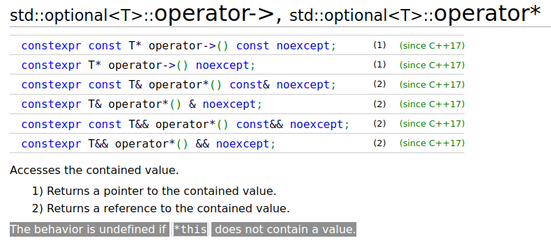

# Memory safety

Over the past two years, the United States Government has been issuing warnings about memory-unsafe programming languages with increasing urgency. Much of the country's critical infrastructure relies on software written in C and C++, languages which are very memory _unsafe_, leaving these systems more vulnerable to exploits by adversaries.

* Nov. 10, 2022 - **NSA Releases Guidance on How to Protect Against Software Memory Safety Issues**[^nsa-guidance]

* Sep. 20, 2023 - **The Urgent Need for Memory Safety in Software Products**[^cisa-urgent]

* Dec. 6, 2023 - **CISA Releases Joint Guide for Software Manufacturers: The Case for Memory Safe Roadmaps**[^cisa-roadmaps]

* Feb. 26, 2024 - **Future Software Should Be Memory Safe**[^white-house]

* May 7, 2024 - **National Cybersecurity Strategy Implementation Plan**[^ncsi-plan]

The government papers are backed by industry research. Microsoft's bug telemetry reveals that 70% of its vulnerabilities would be stopped by memory-safe programming languages.[^ms-vulnerabilities] Google's research has found 68% of 0day exploits are related to memory corruption.[^google-0day] 

* Mar. 4, 2024 - **Secure by Design: Google's Perspective on Memory Safety**[^secure-by-design]

Security professionals loudly advocate that projects migrate away from C++ and start using memory safe languages. But the scale of the problem is daunting. C++ powers products that have generated trillions of dollars of value. There are a lot of C++ programmers and a lot of C++ code. Given how wide-spread C and C++ code is, what can industry really do to improve software quality and reduce vulnerabilities? What are the options for introducing new memory safe code into existing projects and hardening software that already exists?

There's only one systems-level/non-garbage collected language that provides rigorous memory safety. That's the Rust language.[^rust-language] But while they play in the same space, C++ and Rust are idiomatically very different with limited interop capability, making incremental migration from C++ to Rust a slow, painstaking process.

Rust lacks function overloading, templates and inheritance. C++ lacks traits, relocation and lifetime parameters. These discrepancies are responsible for an impedence mismatch when interfacing the two languages. Most code generators for inter-language bindings do not even attempt to represent the features of one language in terms of the features of another. They typically identify a number of special vocabulary types,[^vocabulary-types] which have first-class ergonomics, and limit functionality of other constructs.

The foreignness of Rust for career C++ developers along with the inadequacies of interop tools makes hardening C++ applications by rewriting critical sections in Rust very difficult. Why is there no in-language solution to memory safety? _Why not a Safe C++?_

## Extend C++ for safety

My aim is to produce a superset of C++ that has a rigorously safe subset. Start a new project, or take an existing one, and write safe code in C++. Code written in the safety context exhibits the same strong safety guarantees as safe code programmed in Rust. Indeed, lifetime safety is enforced statically with borrow checking, the signature safety technology first introduced in Rust.[^borrow-checking]

The argument for Rust: it's a clean new language designed from the ground up for safety.

The argument for Safe C++: it provides the same rigorous safety guarantees as Rust, but since it extends C++, it has unbeatable interoperability with your existing code.

The goal is to write robust, sound software. Rust is a proven tool to achieve that. Safe C++ could be another viable tool. What's not viable is to continue adding unsafe, vulnerability-ridden code.

What properties characterize Safe C++?

* A superset of C++ with a _safe subset_. Undefined behavior is prohibited from originating in the safe subset.
* The safe and unsafe parts of the language are clearly delineated, and users must explicitly leave the safe context to use unsafe operations.
* The safe subset must remain _useful_. If we get rid of a crucial unsafe technology, like unions or pointers, we should supply a safe alternative, like choice types or borrows. A perfectly safe language is not useful if it's so inexpressive you can't get your work done.
* The new system can't break existing code. If you point a Safe C++ compiler at existing C++ code, that code must compile normally. Users opt into the new safety mechanisms. Safe C++ is an extension of C++. It's not a new language.

```cpp
#feature on safety
#include "std2.h"

int main() safe {
  std2::vector<int> vec { 11, 15, 20 };

  for(int x : vec) {
    // Ill-formed. mutate of vec invalidates iterator in ranged-for.
    if(x % 2)
      vec^.push_back(x);

    unsafe printf("%d\n", x);
  }
}
```
```txt
$ circle iter3.cxx 
safety: iter3.cxx:10:10
      vec^.push_back(x); 
         ^
mutable borrow of vec between its shared borrow and its use
loan created at iter3.cxx:7:15
  for(int x : vec) { 
              ^
```

Consider this demonstration of Safe C++ that catches iterator invalidation, which would lead to a use-after-free bug. Let's break it down line by line:

Line 1: `#feature on safety` - Turn on the new safety-related keywords within this file. Other files in your translation unit are unaffected. This is how Safe C++ avoids breaking existing code--everything is opt-in, including the new keywords and syntax. The safety feature changes the object model for function definitions, enabling object relocation, partial and deferred initialization. It lowers function definitions to mid-level intermediate representation (MIR)[^mir], on which borrow checking is performed to flag potential use-after-free bugs on checked references.

Line 2: `#include "std2.h"` - Include the new safe containers and algorithms. Safety hardening is about reducing your exposure to unsafe APIs. The current Standard Library is full of unsafe APIs. The new Standard Library in namespace `std2` will provide the same basic functionality, but with containers that are lifetime-aware and type safe.

Line 4: `int main() safe` - The new _safe-specifier_ is part of a function's type, just like _noexcept-specifier_. To callers, the function is marked as safe, so that it can be called from a safe context. `main`'s definition starts in a safe context, so unsafe operations like pointer dereferences, and calling unsafe functions, is not allowed. Rust's functions are safe by default. C++'s are unsafe by default. But that's now just a syntax difference. Once you enter a safe context in C++ by using the _safe-specifier_, you're backed by the same rigorous safety guarantees that Rust provides.

Line 5: `std2::vector<int> vec { 11, 15, 20 };` - List initialization of a memory-safe vector. This vector is aware of lifetime parameters, so borrow checking would extend to element types that have lifetimes. The vector's constructor doesn't use `std::initializer_list<int>`[^init-list]. That type is problematic for two reasons: first, users are given pointers into the argument data, and reading from pointers is unsafe; second, the `std::initializer_list` _doesn't own_ its data, making relocation impossible. For these reasons, Safe C++ introduces a `std2::initializer_list<T>`, which can be used in a safe context and supports our ownership object model.

Line 7: `for(int x : vec)` - Ranged-for on the vector. The standard mechanism[^ranged-for] returns a pair of iterators, which are pointers wrapped in classes. C++ iterators are unsafe. They come in begin and end pairs, and don't share common lifetime parameters, making borrow checking them impractical. The Safe C++ version uses slice iterators, which resemble Rust's `Iterator`.[^rust-iterator] These safe types use lifetime parameters making them robust against iterator invalidation.

Line 10: `vec^.push_back(x);` - Push a value onto the vector. What's the `^` doing there? That's a _postfix-object-operator_ which indicates a mutable borrow on the object argument of the member function call. When `#feature on safety` is enabled, _all mutations are explicit_. Explicit mutation lends precision when choosing between shared borrows and mutable borrows of an object. Rust doesn't feature function overloading, so it will implicitly borrow (mutably or shared) from the member function's object. C++ of course has function overloading, so we'll need to be explicit in order to get the overload we want.

Line 12: `unsafe printf("%d\n", x);` - Call `printf`. It's a very unsafe function. Since we're in a safe context, we have to escape with the `unsafe` keyword. Safe C++ doesn't lock off any parts of the C++ language. You're free to shoot yourself in the foot, provided you sign the waiver in the form of the `unsafe` keyword. `unsafe` means that you swear to follow the preconditions of the function, rather than relying on the compiler to ensure those preconditions for you.

If `main` checks out syntatically, its AST is lowered to MIR, where it is borrow checked. The hidden iterator that powers the ranged-for loop stays initialized during execution of the loop. The `push_back` _invalidates_ that iterator, by mutating a place (the vector) that the iterator has a constraint on. When the value `x` is next loaded out of the iterator, the borrow checker raises an error: `mutable borrow of vec between its shared borrow and its use`. The borrow checker prevents Circle compiling a program that may have exhibited undefined behavior. This is all done at compile time, with no impact on your program's size or speed.

This sample is only a few lines, but I've introduced many new mechanisms and types. Security experts keep reminding us, and it is true, that **C++ is very unsafe**. It takes a systematic effort to supply a superset of the language with a safe subset that has enough flexibility to remain expressive.

## The memory safety value proposition

Memory-safe languages are predicated on a basic observation of human nature: people would rather try something, and only then ask for help if it doesn't work. For programming, this means developers try to use a library, and only then read the docs if they can't get it to work. This has proven very dangerous, since appearing to work is not the same as working.

Many C++ functions have preconditions that are only known after careful of their perusal of their documentation. Preconditions can be anything; users don't come with expectations as to what safe usage should look like. Violating preconditions, which is possible with benign-looking usage, causes undefined behavior and opens your software to attack. **Software safety and security should not be predicated on programmers following documentation.** 

Here's the value proposition: compiler and library vendors make an extra effort to provide a robust environment so that users _don't have to read the docs_. No matter how they use the language and library, their actions will not raise undefined behavior and open the software to safety-related exploits. No system can guard against all misuse, and hastily written code may have plenty of logic bugs. But those logic bugs won't lead to memory safety vulnerabilities.

Last week I found that my compiler would occassional segfault on some input. I tracked the issue down to a usage of `std::isprint`.[^isprint] This function has an `int` parameter. I was calling it with UNICODE code points. I didn't consider that I might be violating the preconditions, which require that the function be called only with an argument between -1 and 255:

> Like all other functions from `<cctype>`, the behavior of `std::isprint` is undefined if the argument's value is neither representable as unsigned char nor equal to EOF. To use these functions safely with plain chars (or signed chars), the argument should first be converted to unsigned char.
> Similarly, they should not be directly used with standard algorithms when the iterator's value type is char or signed char. Instead, convert the value to unsigned char first.

This is very stupid. While the mistake was mine, the library's design goes against human nature. Do not rely on the programmer to closely read the docs before using your function. The safe context provided by memory safe languages prevents usage or authoring of functions like `std::isprint` which exhibit undefined behavior. 

Some memory safety issues, like the one described above, are easy to fix. Others can't be fixed in a language as unsafe as ISO C++. It's not enough to read documentation, follow C++ Core Guidelines[^core-guidelines] or write unit tests. To address lifetime and thread safety issues, new language technologies like borrow checking and fearless concurrency[^fearless-concurrency] are essential. These are non-local problems and require system-wide solutions.

## Categories of safety

I like to break the memory safety problem down into five categories. Each of these is addressed with a different strategy.

### 1. [Lifetime safety](lifetime.md)

This is a hard one. How do we eliminate dangling pointer bugs[^dangling-pointer] for objects that are allocated on the stack? Borrow checker technology is a compile-time local analysis that defines a network of constraints against a function's control flow graph. Solving the constraints grows regions, which define the points at which each loan is in scope. Invalidating actions, such as reads or writes to places that overlap in-scope loans raise borrow checker errors. This is a brilliant system. It's compatible with C++'s manual memory management and RAII[^raii] object model.

Borrow checking a function only has to consider the body of that function. It avoids whole-program analysis by instituting the _Law of Exclusivity_. Checked references (borrows) come in two flavors: mutable and shared, noted respectively as `T^` and `const T^`. There can be one live mutable reference to a place, or any number of shared references to a place, but not both at once. Upholding this principle makes it much easier to reason about your program. If a function is passed a mutable reference and some shared references, you can be certain that the function won't have side effects that, through the mutable reference, cause the invalidation of those shared references. Why not? Because you can't form shared references to an overlapping same place as the mutable reference to even pass to that function.

This principle eliminates much subtlety needed for library work. The downside is a loss of flexibility. There are idioms that are expressible with unsafe that aren't expressible with borrows. Clever engineers have spent a lot of effort developing safe analogs to existing unsafe paradigms.

Is there a learning curve? Is there disruption? Of course. But what alternative do we have? C++'s current safety story is unacceptable. If you're going to keep writing code that runs on devices attached to the network, you're going to have to harden it against vulnerabilities. If you want to use manual memory management and RAII, the borrow is the only viable option.

### 2. [Type safety - null variety](type.md)

> I call it my billion-dollar mistake. It was the invention of the null reference in 1965. At that time, I was designing the first comprehensive type system for references in an object oriented language (ALGOL W). My goal was to ensure that all use of references should be absolutely safe, with checking performed automatically by the compiler. But I couldn't resist the temptation to put in a null reference, simply because it was so easy to implement. This has led to innumerable errors, vulnerabilities, and system crashes, which have probably caused a billion dollars of pain and damage in the last forty years.
>
> -- <cite>Tony Hoare[^hoare]</cite>

The "billion-dollar mistake" is a type safety problem. Consider `std::unique_ptr`. It has two states: engaged and disengaged. The class presents member functions like `operator*` and `operator->` that are valid when the object is in the engaged state and _undefined_ when the object is disengaged. `->` is the most important API for smart pointers. Calling it when the pointer is null? That's your billion-dollar mistake.

As Hoare observes, the problem was conflating two different things, a pointer to an object and an empty state, into the same type and giving them the same interface. Smart pointers should only hold valid pointers. If you want to represent an empty state, use some other mechanism that has its own interface. Denying the null state eliminates undefined behavior.

`std2::unique_ptr` has no null state. There's no default constructor. If the object is in scope, you can dereference it without risk of undefined behavior. Why doesn't C++ simply introduce its own fixed `unique_ptr` without a null state? Blame C++11 move semantics.

How do you move objects around in C++? Use `std::move` to select the move constructor. That moves data out of the old object, leaving it in a default state. For smart pointers, that's the null state. If `unique_ptr` didn't have a null state, it couldn't be moved in C++.

Addressing the null type safety problem means entails overhauling the object model. Safe C++ features a new kind of move: [_relocation_](type.md#relocation-object-model), also called _destructive move_. Unless explicitly initialized, objects start out _uninitialized_. They can't be used in this state. When you assign to an object, it becomes initialized. When you relocate from an object, it's back to being uninitialized. If you relocate from an object inside control flow, it becomes _potentially uninitialized_, and its destructor is conditionally executed after reading an automatically-generated drop flag.

```cpp
int main() {
  // p is uninitialized.
  std2::unique_ptr<int> p;

  // Error: p is uninitialized.
  int x = *p;

  // p is definitely initialized.
  p = std2::unique_ptr<int>::make(5);

  // Ok.
  int y = *p;

  // p is moved into q. Now p is uninitialized again.
  auto q = rel p;

  // Error: p is uninitialized.
  int z = *p;
}
```

The _rel-expression_ names a local variable object or subobject and relocates that into a new value. The old object becomes uninitialized. Any uses of uninitialized objects generates a compiler error. Using a null `unique_ptr` was undefined behavior. Using an uninitialized one is a compile-time error.

We have to reimagine our standard library in the presence of relocation. Most kinds of resource handles include null states. These should all be replaced by safe versions to reduce exposure to unsafe APIs.

### 3. [Type safety - union variety](type.md)

The compiler can only relocate local variables. How do we move objects that live on the heap, or for which we only have a pointer or reference? We need to use optional types.

```cpp
template<typename T>
choice optional {
  default none,
  some(T)
};

struct Data {
  // May be engaged (some) or disengaged (none).
  optional<std2::unique_ptr<int>> value;
};
```

We use an optional type to represent both aspects of our the smart pointer: disengaged (`none`) and engaged (`some`). If you want to move the pointer, detach it from the optional, which changes the state of the optional from `some` to `none`. The C++ Standard Library has an optional type,[^optional] but it's not safe to use. The optional API is full of undefined behaviors.[^optional-undefined]



A similar class, `std::expected`, which is new to C++23, is also full of undefined behaviors.[^expected-undefined]

If we were to wrap the safe `std2::unique_ptr` in an `std::optional`, it would be just as unsafe as using `std::unique_ptr`. Using `->` with a disengaged value would cause undefined behavior.

The new `std2::optional` is a _choice type_, a first-class discriminated union, that can only be accessed with _pattern matching_. Pattern matching makes the union variety of type safety violations impossible: we can't access the wrong state of the sum type.

```cpp
#include <string>
#include <iostream>

union Value {
  int i32;
  float f32;
  double f64;
  const char* str;
};

void print(Value val) {
  // C++ does not protect us from accessing bits with the wrong type.
  // Catastrophe!
  std::cout<< val.str<< "\n";
}

int main() {
  Value value { };
  value.i32 = 101;
  print(value);
}
```

C++'s sum type support is built on top of unions. Unions are extremely unsafe. Naming a union field is like implicitly using `reintepret_cast` to convert the object's bits into the type of the field. The defects in `std::optional` and `std::expected` are of this nature: the libraries don't guard against access using an invalid type. C++ builds abstractions on top of unions, but they're not _safe_ abstractions.

```cpp
#feature on safety
#include <iostream>
#include <string>

// A discriminated union that's impossible to misuse.
choice Value {
  i32(int),
  f32(float),
  f64(double),
  str(std::string)
};

void print(Value val) {
  match(val) {
    // Type safety bugs are impossible inside the pattern match.
    // The alternatives listed must be exhaustive.
    .i32(i32) => &std::cout<< i32<< "\n";
    .f32(f32) => &std::cout<< f32<< "\n";
    .f64(f64) => &std::cout<< f64<< "\n";
    .str(str) => &std::cout<< str<< "\n";
  };
}

int main() {
  print(.i32(5));
  print(.f32(101.3f));
  print(.f64(3.15159));
  print(.str("Hello safety"));
}
```

Choice types are Circle's type-safe offering. They're just like Rust's enums,[^rust-enum] one of features most credited for that language's enviable ergonomics. Accessing members of a choice object requires testing for the active type with a _match-expression_. If the match succeeds, a new declaration is bound to the corresponding payload, and that declaration is visible in the scope following the `=>`.

The compiler also performs exhaustiveness testing. Users must name all the alternatives, or use a wildcard `_` to default the unnamed ones.

Pattern matching and choice types aren't just a qualify-of-life improvement. They're a critical part of the memory safety puzzle and all modern languages provide them.

### 4. [Thread safety](thread.md)

A memory-safe language should be robust against data races to shared mutable state. If one thread is writing to shared state, no other thread should be allowed access to it. Rust provides thread safety using a really novel extension of the type system. 

TODO

### 5. [Runtime checks](safe.md#panic-functions)

TODO

## The road not taken

There are many efforts at library mitigations[^miracle-ptr] [^buffer-hardening] of undefined behaviors. There is work on sanitizers, which are special build targets that flag undefined behavior at runtime.[^addresssan] [^pizlonator] These kinds of projects serve as a first defense against vulnerabilities in C++ codes. 

But what work has been done to bring memory safety constructs directly to the C++ language? Aside from Circle C++, there is no ongoing effort to extend C++ for the rigorous memory safety guarantees required by security researches in industry and government. There are no attempts at building a safe context into mainline compilers like MSVC, Clang and GCC. Companies that built their fortunes on this language, such as Microsoft, Google, NVIDIA, Intel, Adobe and Bloomberg have not made efforts to stave off its obsolescence. The C++ ISO committee has no insights into this problem and no strategy to address it.

Why have compiler vendors and standardization workers not taken seriously the growing costs of security vulnerabilties in C++? I think it's because the problem seems too challenging for any single effort to make real headway:

**The solution has a broad scope.** Memory safety vulnerabilities come in a menagerie of categories, related to lifetime safety, bounds safety, thread safety, and several flavors of type safety. Each needs its own treatment. The surface area for addressing all of these categories makes for a very large extension. One belief is that all these changes in the aggregate represent too much work for either the committee or the vendors to to deal with.

**Major upgrades to tooling are required.** Not only does the compiler frontend need an overhaul, but a new middle-end is required to support borrow checking and object relocation. A new standard library has to be written that gradually replaces the legacy one, reducing exposure to unsafe operations. Frontend, backend, library. This is a vertical problem larger than the usual remit of compiler developers.

**The new technology is difficult.** The most novel part of Rust's safety model is its NLL borrow checker.[^borrow-checking] This is complicated feature. You can't begin to understand how it works after reading an introductory book about Rust or through casual usage of the language. The sophistication of the feature has scared off everyone from considering integrating the technology into a C++ compiler. It's a beautiful idea, but it feels a bit like mastering alien technology if you're a frontend engineer who doesn't already work extensively with control-flow graphs.

**Mainline compilers are too burdensome for experimentation.** C++ is the result of more than 50 years of evolution, from K&R C to C++23. The language is fantastically complex with compilers that are commensurately challenging to write and maintain. It would be very difficult to do this level of experimentation on MSVC, Clang or GCC. The Circle compiler is only about 310,000 lines of code, which is compact compared to other compilers. I wrote every line, and I know how everything fits together, and this gives me a huge agility advantage compared to people working on the mainline toolchains.

**C++ users are arrogant.** There's an attitude of "get good" among C and C++ practitioners. They reason that if you make a mess of things, it's your own fault, and the solution is to get better. But software design is a collaborative effort, even for one-man shops like my own. You're always relying on other people's code, and you can't understand how it all works. It's not realistic to expect flawless programming on a large project. A memory-safe language makes mistakes much less costlty: your program won't exhibit undefined behavior, and constructs that can't be checked for soundness by the compiler are flagged as potentially unsafe, giving programmers the opportunity to rethink their design and perhaps express those operations using memory safe APIs.

> To begin to shape standards of care for secure software development, the Administration will drive the development of an adaptable safe harbor framework to shield from liability companies that securely develop and maintain their software products and services…The Administration will work with Congress and the private sector to develop legislation establishing liability for software products and services. 
>
> National Cybersecurity Implementation Plan[^ncsi-plan]

Institutional users of C++ should be worried. The security community is baying for this language's extinction. The government is talking about liability for companies that ship vulnerable code, and a shield from liability for developing safety strategies. Legislation banning C++'s use in certain sectors looks like a possibility. The ISO committee denies the severity of the problem and has no strategy or domain experts.

 I don't think nitpicking the NSA is a compelling response. _We have to do something real._ I want to work with C++ stakeholder companies and work to solve the underlying problem. It'll take effort to make C++ a language that developers are both _allowed to use_ and _would like to use_ in the decades ahead.


[^nsa-guidance]: [NSA Releases Guidance on How to Protect Against Software Memory Safety Issues](https://www.nsa.gov/Press-Room/News-Highlights/Article/Article/3215760/nsa-releases-guidance-on-how-to-protect-against-software-memory-safety-issues/)

[^cisa-urgent]: [The Urgent Need for Memory Safety in Software Products](https://www.cisa.gov/news-events/news/urgent-need-memory-safety-software-products)

[^cisa-roadmaps]: [CISA Releases Joint Guide for Software Manufacturers: The Case for Memory Safe Roadmaps](https://www.cisa.gov/news-events/alerts/2023/12/06/cisa-releases-joint-guide-software-manufacturers-case-memory-safe-roadmaps)

[^white-house]: [Future Software Should Be Memory Safe](https://www.whitehouse.gov/oncd/briefing-room/2024/02/26/press-release-technical-report/)

[^ncsi-plan]: [National Cybersecurity Strategy Implementation Plan](https://www.whitehouse.gov/wp-content/uploads/2024/05/NCSIP-Version-2-FINAL-May-2024.pdf)

[^ms-vulnerabilities]: [We need a safer systems programming language](https://msrc.microsoft.com/blog/2019/07/we-need-a-safer-systems-programming-languag
[^google-0day]: [0day "In the Wild"](https://googleprojectzero.blogspot.com/p/0day.html)

[^secure-by-design]: [Secure by Design: Google's Perspective on Memory Safety](https://research.google/pubs/secure-by-design-googles-perspective-on-memory-safety/)

[^rust-language]: [The Rust Programming Language](https://doc.rust-lang.org/book/)

[^vocabulary-types]: [CXX — safe interop between Rust and C++](https://cxx.rs/bindings.html)

[^borrow-checking]: [The Rust RFC Book - Non-lexical lifetimes](https://rust-lang.github.io/rfcs/2094-nll.html)

[^mir]: [The Rust RFC Book - Mid-level IR](https://rust-lang.github.io/rfcs/1211-mir.html)

[^init-list]: [std::initializer_list](https://en.cppreference.com/w/cpp/utility/initializer_list)

[^ranged-for]: [Range-based for loop](https://en.cppreference.com/w/cpp/language/range-for)

[^rust-iterator]: [`Iterator` in `std::iter`](https://doc.rust-lang.org/std/iter/trait.Iterator.html)

[^isprint]: [`std::isprint`](https://en.cppreference.com/w/cpp/string/byte/isprint)

[^core-guidelines]: [C++ Core Guidelines](https://isocpp.github.io/CppCoreGuidelines/CppCoreGuidelines)

[^fearless-concurrency]: [Fearless Concurrency](https://doc.rust-lang.org/book/ch16-00-concurrency.html)

[^dangling-pointer]: [Dangling pointer](https://en.wikipedia.org/wiki/Dangling_pointer)

[^raii]: [Resource acquisition is initialization](https://en.wikipedia.org/wiki/Resource_acquisition_is_initialization)

[^hoare]: [Tony Hoare](https://en.wikipedia.org/wiki/Tony_Hoare)

[^optional]: [`std::optional`](https://en.cppreference.com/w/cpp/utility/optional)

[^optional-undefined]: [`std::optional<T>::operator->`](https://en.cppreference.com/w/cpp/utility/optional/operator*)

[^expected-undefined]: [`std::expected<T>::operator->`](https://en.cppreference.com/w/cpp/utility/expected/operator*)

[^rust-enum]: [Defining an enum](https://doc.rust-lang.org/book/ch06-01-defining-an-enum.html)

[^miracle-ptr]: [MiraclePtr aka raw_ptr aka BackupRefPtr](https://chromium.googlesource.com/chromium/src/+/ddc017f9569973a731a574be4199d8400616f5a5/base/memory/raw_ptr.md)

[^buffer-hardening]: [RFC: C++ Buffer Hardening](https://discourse.llvm.org/t/rfc-c-buffer-hardening/65734)

[^addresssan]: [AddressSanitizer](https://github.com/google/sanitizers/wiki/AddressSanitizer)

[^pizlonator]: [The Fil-C Memory Safety Manifesto: FUGC Yeah!](https://github.com/pizlonator/llvm-project-deluge/blob/deluge/Manifesto.md)
